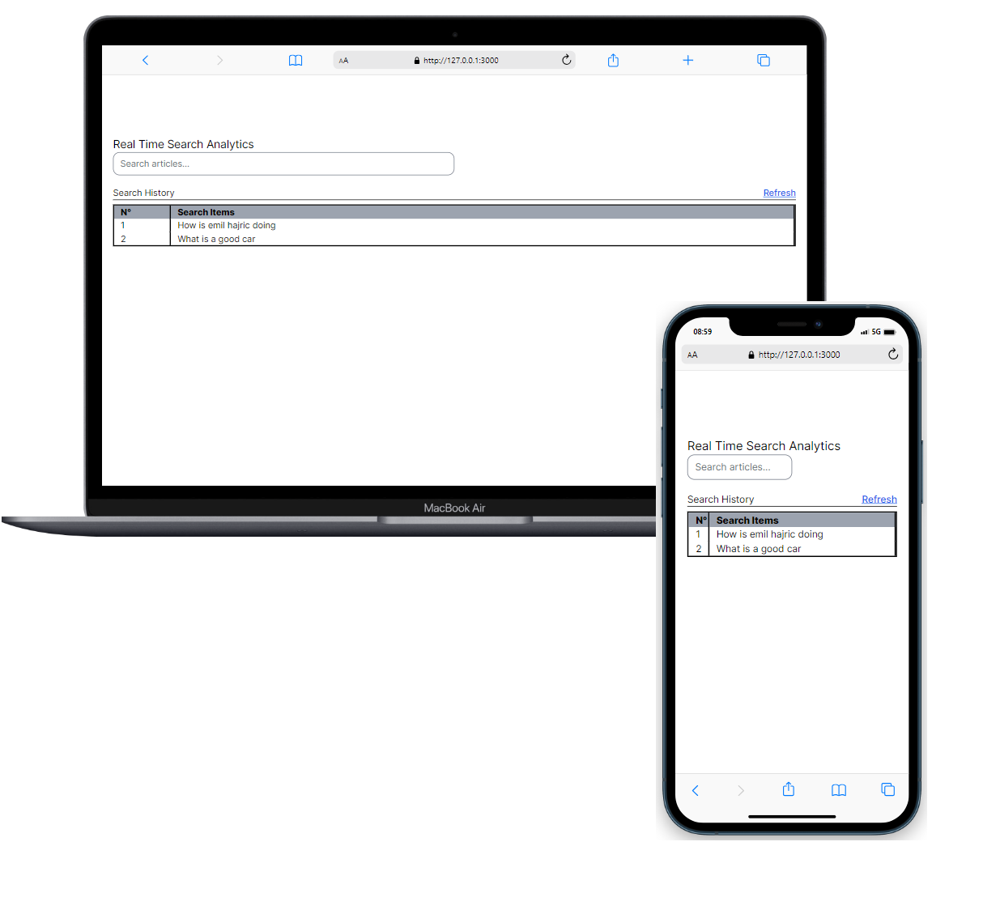

  

# 📗 Table of Contents

- [📖About the Project](#about-project)
  - [🛠 Built With](#built-with)
    - [Tech Stack](#tech-stack)
    - [Key Features](#key-features)
    - [Live Demo](#live-demo)
    - [Video Presentation](#video-presentation)
- [💻 Getting Started](#getting-started)
  - [Setup](#setup)
  - [Prerequisites](#prerequisites)
  - [Install](#install)
  - [Usage](#usage)
  - [Run tests](#run-tests)
- [👥 Authors](#authors)
- [🔭 Future Features](#future-features)
- [🤝 Contributing](#contributing)
- [⭐️ Show your support](#support)
- [🙏 Acknowledgements](#acknowledgements)
- [📝 License](#license)

# 📖 Real Time Search Analytics APP

**Real Time Search Analytics App** is a realtime search box, where users search articles, and then to have analytics that display what users were searching for.

## 🛠 Built With 

### Tech Stack 

- 
Client

    <ul>
      <li><a href="https://rubyonrails.org/">Ruby on Rails</a></li>
      <li><a href="https://www.postgresql.org/">PostgreSQL</a></li>
    </ul>

### Key Features 
- Realtime search
- Remove incompleted queries
- Search History

### Live Demo 
[Open Live demo](https://real-time-search-analytics-3dda18ead592.herokuapp.com)

### Video Presentation 
[Video Presentation](https://www.loom.com/share/7cb44630e59946bda7220a78496b5a89?sid=b4a6dcdb-ffad-448b-ba1d-3ea452eb6069)

## 💻 Getting Started 

To get a local copy up and running, follow these steps:

### Prerequisites
In order to run this project you need:

- A browser of you choice.
- A text editor of your choice.
- Install ruby gem and depencies on your local system
- Install Postgresql

### Setup
Clone this repository to your desired folder:

- Use the following Commands:
  - `git clone https://github.com/momo-87/real-time-search-box.git`
  - `cd real-time-search-box`

### Usage
- Create the .env file and set your PostgreSQL connexion parameter as environment variables:
  - USER_NAME
  - PASSWORD
- Install the required gem libraries by running: `bundle install`
- To start the project, run: `rails s`
- To start the background processes, run: `bundle exec clockwork lib/cleanup_schedule.rb`

### Run tests
- Use the folling command to run the RSpec tests: `rspec spec`

## 👥 Authors 

👤 **Christian Momo**

- GitHub: [@githubhandle](https://www.github.com/momo-87)
- Twitter: [@twitterhandle](https://twitter.com/Momo_yde)
- LinkedIn: [LinkedIn](https://www.linkedin.com/in/christian-momo/)

## 🔭 Future Features 
- [ ] Improving scalobolity
- [ ] improving styling

## 🤝 Contributing 
Contributions, issues, and feature requests are welcome!
Feel free to check the [issues page](https://github.com/momo-87/real-time-search-box/issues)

## ⭐️ Show your support 
If you like this project, give it a star and share it.

## 🙏 Acknowledgments 
I would like to thank [Emil Hajric](https://www.linkedin.com/in/emilhajric/), CEO at [Helpjuice](https://helpjuice.com/?gclid=Cj0KCQiAkeSsBhDUARIsAK3tiedMPlP90D6o61eH_8g8eVm8M4LEg9bAyI1VhyETdQ5omf8b0CAFksoaAhdzEALw_wcB) for giving me the opportunity to take to work on this project.

## 📝 License 

This project is [MIT](./LICENSE) licensed.

(<a href="#readme-top">back to top</a>)

